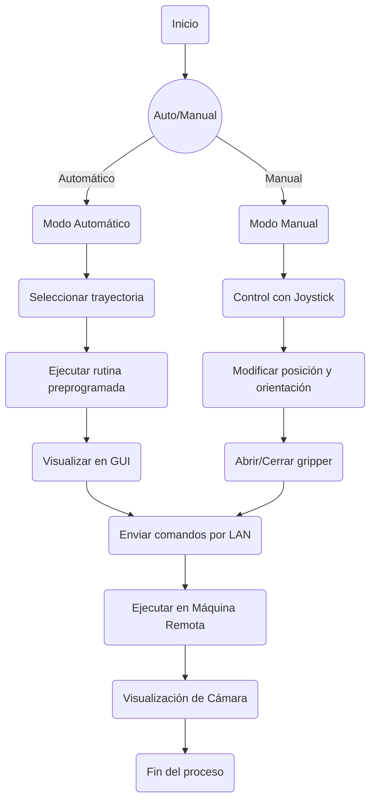

# Informe final Robotica

### Tabla de párametros DH y cinemática Directa (incluye un reultado númerico).

Obtenidas mediante el RVCToolbox de PeterCorke
```
%% MODELO DEL ROBOT CON ROBOTICS TOOLBOX
L1 = Link('d', 0.137, 'a', 0, 'alpha', -pi/2, 'offset', 0);
L2 = Link('d', 0, 'a', 0.105, 'alpha', 0, 'offset', -pi/2);
L3 = Link('d', 0, 'a', 0.105, 'alpha', 0, 'offset', 0);
L4 = Link('d', 0, 'a', 0.110, 'alpha', 0, 'offset', 0);
```

### Cálculo de la Cinemática Inversa del pincher (incluye un resultado númerico).

El cálculo fue realizaddo utilizando este código en MATLAB.

```
function [theta_0, theta_1, theta_2, theta_3] = inverse_kinematics(X, Y, Z, phi)
    % Longitudes de los eslabones
    a0 = 0.137;
    a1 = 0.105;
    a2 = 0.105;
    a3 = 0.110;
    
    phi1=deg2rad(phi);
    phi1=-phi1;

    % Ángulo base
    theta_0 = atan2(Y, X);
    
    % Proyección en el plano XY
    xb = sqrt(X^2 + Y^2);
    yb = Z - a0;
    
    xa = xb - a3*cos(phi1);
    ya = yb - a3*sin(phi1);
    
    D = sqrt(xa^2 + ya^2);

    % Verificar alcanzabilidad
    if D > (a1 + a2) || D < abs(a1 - a2)
        error('Posición no alcanzable');
    end


    cos_theta2 = (D^2 - a1^2 - a2^2)/(2*a1*a2);
    theta_2 = acos(cos_theta2);
    theta_2_alt = -theta_2;

    % Calcular ángulos theta1
    alpha = atan2(ya, xa);
    beta = atan2(a2*sin(theta_2), a1 + a2*cos(theta_2));
    theta_1 = alpha - beta;
    theta_1 = alpha - beta + 90;

    beta_alt = atan2(a2*sin(theta_2_alt), a1 + a2*cos(theta_2_alt));
    theta_1_alt = alpha - beta_alt;
    
    % Calcular theta3
    theta_3 = phi1 - theta_1 - theta_2;
    theta_3_alt = phi1 - theta_1_alt - theta_2_alt;

    % Convertir a grados
    theta_0 = rad2deg(theta_0);
    theta_1 = rad2deg(theta_1_alt);
    theta_1 = theta_1 - 90;
    theta_2 = rad2deg(theta_2_alt);
    theta_3 = rad2deg(theta_3_alt);

    theta_1 = -theta_1;
    theta_2 = -theta_2;
    theta_3 = -theta_3;
end
```
## Descripción de la solución creada, el proceso de preparación y programación (hay que ser detallado, podemos usar los vídeos del whatsapp en esta parte).

Para la solución del problema decidimos usar un paquete de ROS2 que crease un nodo tipo publisher, el cual publica un mensaje  un tópico dado en base a los comandos recibidos desde el joystick. Una vez el nodo envía los mensajes con el formato correcto podemos configurar otro nodo que este suscrito a ese  tópico y mueva una simulación en coppelia usando los comandos recibidos. De la misma forma para mover el robot físico se utiliza el paquete de dynamixel sdk para crear un segundo nodo suscrito al tópico y enviarle las mismas instrucciones de comando


## Diagrama de flujo de las acciones del robot.

### Plano de planta y descripción de la teleoperación.
### Código en Matlab o Python de la solución.
### Comparación objetiva de la teleoperación manual y automática realizada los robots.

|Teleoperación Manual|Operación Automática|
|---|---|
|Requiere al operador en todo momento|No requiere que ningún operador este presente para que se ejecute|
|require mayor poder computacional|requiere menos capacidad por parte de la computadora|
|el joystick opera manipulando la velocidad|el usuario selecciona un punto de salida y la rutina preprogamada hace el resto|

### Vídeo de la implementación (Incluir la intro del LabSIR: https://drive.google.com/file/d/1wSxw7m7n5hXOtkc8C0H0lLAxTx3BqQSe/view).

https://www.youtube.com/watch?v=VTimMgNupZ8&ab_channel=JuanDicaprio-GuillermoDelToroProfesores
