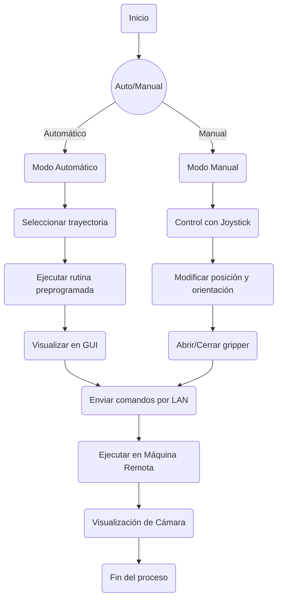

# Informe final Robotica

## Tabla de párametros DH y cinemática Directa (incluye un reultado númerico).

Obtenidas mediante el RVCToolbox de PeterCorke
```
%% MODELO DEL ROBOT CON ROBOTICS TOOLBOX
L1 = Link('d', 0.137, 'a', 0, 'alpha', -pi/2, 'offset', 0);
L2 = Link('d', 0, 'a', 0.105, 'alpha', 0, 'offset', -pi/2);
L3 = Link('d', 0, 'a', 0.105, 'alpha', 0, 'offset', 0);
L4 = Link('d', 0, 'a', 0.110, 'alpha', 0, 'offset', 0);
```

## Cálculo de la Cinemática Inversa del pincher (incluye un resultado númerico).

El cálculo fue realizado utilizando este código en MATLAB.

```
function [theta_0, theta_1, theta_2, theta_3] = inverse_kinematics(X, Y, Z, phi)
    % Longitudes de los eslabones
    a0 = 0.137;
    a1 = 0.105;
    a2 = 0.105;
    a3 = 0.110;
    
    phi1=deg2rad(phi);
    phi1=-phi1;

    % Ángulo base
    theta_0 = atan2(Y, X);
    
    % Proyección en el plano XY
    xb = sqrt(X^2 + Y^2);
    yb = Z - a0;
    
    xa = xb - a3*cos(phi1);
    ya = yb - a3*sin(phi1);
    
    D = sqrt(xa^2 + ya^2);

    % Verificar alcanzabilidad
    if D > (a1 + a2) || D < abs(a1 - a2)
        error('Posición no alcanzable');
    end


    cos_theta2 = (D^2 - a1^2 - a2^2)/(2*a1*a2);
    theta_2 = acos(cos_theta2);
    theta_2_alt = -theta_2;

    % Calcular ángulos theta1
    alpha = atan2(ya, xa);
    beta = atan2(a2*sin(theta_2), a1 + a2*cos(theta_2));
    theta_1 = alpha - beta;
    theta_1 = alpha - beta + 90;

    beta_alt = atan2(a2*sin(theta_2_alt), a1 + a2*cos(theta_2_alt));
    theta_1_alt = alpha - beta_alt;
    
    % Calcular theta3
    theta_3 = phi1 - theta_1 - theta_2;
    theta_3_alt = phi1 - theta_1_alt - theta_2_alt;

    % Convertir a grados
    theta_0 = rad2deg(theta_0);
    theta_1 = rad2deg(theta_1_alt);
    theta_1 = theta_1 - 90;
    theta_2 = rad2deg(theta_2_alt);
    theta_3 = rad2deg(theta_3_alt);

    theta_1 = -theta_1;
    theta_2 = -theta_2;
    theta_3 = -theta_3;
end
```
Posteriormente se convirtió a python para poder correrlo directamente sobre el nodo:
```
def inverse_kinematics(X, Y, Z, phi):
    # Longitudes de los eslabones
    a0 = 0.137
    a1 = 0.105
    a2 = 0.105
    a3 = 0.110
    
    phi1 = np.deg2rad(phi)
    phi1 = -phi1
    
    # Ángulo base
    theta_0 = np.arctan2(Y, X)
    
    # Proyección en el plano XY
    xb = np.sqrt(X**2 + Y**2)
    yb = Z - a0
    
    xa = xb - a3 * np.cos(phi1)
    ya = yb - a3 * np.sin(phi1)
    
    D = np.sqrt(xa**2 + ya**2)
    
    # Verificar alcanzabilidad
    if D > (a1 + a2) or D < abs(a1 - a2):
        raise ValueError("Posición no alcanzable")
    
    cos_theta2 = (D**2 - a1**2 - a2**2) / (2 * a1 * a2)
    theta_2 = np.arccos(cos_theta2)
    theta_2_alt = -theta_2
    
    # Calcular ángulos theta1
    alpha = np.arctan2(ya, xa)
    beta = np.arctan2(a2 * np.sin(theta_2), a1 + a2 * np.cos(theta_2))
    theta_1 = alpha - beta + np.deg2rad(90)
    
    beta_alt = np.arctan2(a2 * np.sin(theta_2_alt), a1 + a2 * np.cos(theta_2_alt))
    theta_1_alt = alpha - beta_alt
    
    # Calcular theta3
    theta_3 = phi1 - theta_1 - theta_2
    theta_3_alt = phi1 - theta_1_alt - theta_2_alt
    
    # Convertir a grados
    theta_0 = np.rad2deg(theta_0)
    theta_1 = np.rad2deg(theta_1_alt) - 90
    theta_2 = np.rad2deg(theta_2_alt)
    theta_3 = np.rad2deg(theta_3_alt)
    
    theta_1 = -theta_1
    theta_2 = -theta_2
    theta_3 = -theta_3
    
    theta_0 = np.radians(theta_0)
    theta_1 = np.radians(theta_1)
    theta_2 = np.radians(theta_2)
    theta_3 = np.radians(theta_3)
    
    return theta_0, theta_1, theta_2, theta_3
```
## Descripción de la solución creada, el proceso de preparación y programación (hay que ser detallado, podemos usar los vídeos del whatsapp en esta parte).

## Control y Simulación del PhantomX con ROS2

### Descripción

Este documento describe el proceso de configuración y control del robot PhantomX mediante ROS2, empleando un joystick para la teleoperación y la simulación en CoppeliaSim.

### Creación del Nodo Joy

Lo primero fue crear un nodo de `joy` para obtener las posiciones de los análogos del joystick en cada instante y poder mapear todos los botones del control escogido.

### Instalación de Joy en ROS2 Linux

Para instalar `joy` en ROS2 en un sistema Linux, se deben ejecutar los siguientes comandos:

```bash
sudo apt update
sudo apt install ros-${ROS_DISTRO}-joy ros-${ROS_DISTRO}-joy-linux
```

Después de la instalación, se puede verificar su funcionamiento ejecutando:

```bash
ros2 run joy joy_node
```

### Nodo para Control y Cinemática Inversa

Luego, se creó un nodo encargado de obtener las posiciones de los controles y publicar un tópico llamado `JointState` del tipo `/coppelia/joint_commands`.

En este nodo también se incorporaron las ecuaciones de la cinemática inversa traducidas de MATLAB a Python luego de su verificación en simulaciones.

El nodo coloca las articulaciones en una posición de *home* definida por las siguientes coordenadas:

```plaintext
X = 0
Y = 0.12
Z = 0.12
phi = 45
```

Estas coordenadas pasan por la cinemática inversa y se obtienen los grados en radianes que usará cada una de las articulaciones. Cada vez que se ejecuta el nodo con la función *callback*, se suman o restan los valores de la posición de los análogos (esta posición varía de -1 a 1).

### Asignación de Controles:

1. First ordered list item
2. Another item
⋅⋅* Unordered sub-list. 
1. Actual numbers don't matter, just that it's a number
⋅⋅1. Ordered sub-list
4. And another item.

⋅⋅⋅You can have properly indented paragraphs within list items. Notice the blank line above, and the leading spaces (at least one, but we'll use three here to also align the raw Markdown).

⋅⋅⋅To have a line break without a paragraph, you will need to use two trailing spaces.⋅⋅
⋅⋅⋅Note that this line is separate, but within the same paragraph.⋅⋅
⋅⋅⋅(This is contrary to the typical GFM line break behaviour, where trailing spaces are not required.)

* Unordered list can use asterisks
- Or minuses
+ Or pluses

El control se realiza mediante posición y cinemática inversa, pero dado que el incremento en cada coordenada depende de la inclinación de la palanca del mando, se puede decir que la velocidad del efector final varía en función de esta inclinación.

##· Nodo PhantomXController

Una vez publicado el tópico con las posiciones de cada motor, se crea un nuevo nodo llamado `PhantomXController`, el cual se encarga de enviar los datos mediante la librería `Dynamixel SDK`.

Este nodo se ejecuta en un segundo PC encargado de controlar directamente el robot. Para este nodo, se establecen los siguientes parámetros:

### Configuración del puerto y baudrate
```python
DEVICENAME = "/dev/ttyUSB0"  # Ajusta según tu sistema
BAUDRATE = 1000000  # 1 Mbps, recomendado para AX-12A
```

### Direcciones de memoria en los motores Dynamixel AX-12A
```python
ADDR_TORQUE_ENABLE = 24
ADDR_GOAL_POSITION = 30
ADDR_PRESENT_POSITION = 36
ADDR_MOVING_SPEED = 32
ADDR_TORQUE_LIMIT = 34
```

### Parámetros del motor
```python
DXL_IDs = [1, 2, 3, 4, 5]  # IDs de los motores del brazo
TORQUE_ENABLE = 1  # Habilitar torque
TORQUE_DISABLE = 0  # Deshabilitar torque
MOVING_SPEED = {1: 40, 2: 40, 3: 40, 4: 40, 5: 1023}  # Velocidad del motor (0-1023)
TORQUE_LIMITS = {1: 300, 2: 600, 3: 600, 4: 600, 5: 1023}  # Límite de torque para cada motor
GOAL_POSITION_DEFAULT = {1: 1023, 2: 512, 3: 512, 4: 512, 5: 512}  # Posición inicial
```

En estos parámetros se establece el puerto, la velocidad en baudios, direcciones de memoria de cada uno de los registros, parámetros específicos para cada motor (se decidió usar torque y velocidades bajas) y una posición de *home* para verificación.

El nodo comienza enviando todas las configuraciones iniciales a cada motor, lo cual se realiza mediante un identificador único de cada motor (*ID*), en este caso los números `1, 2, 3, 4 y 5`.

También se agregaron verificaciones de conexión con el puerto y métodos para cerrar correctamente el nodo.

## Simulación en CoppeliaSim


CoppeliaSim se encarga de escuchar el mismo nodo y ejecutar la simulación en simultáneo. De esta manera, se obtiene una simulación en vivo que permite la teleoperación del PhantomX.

## Rutina Automática con Bag Record

Para establecer un modo automático en el nodo, se utilizó el comando `bag record` de ROS2, que permite grabar la publicación del tópico `joint_commands`. Para iniciar la grabación, se ejecuta el siguiente comando:

### Uso del comando Bag Record en ROS2

```bash
ros2 bag record -o mi_grabacion /coppelia/joint_commands
```

Esto generará una grabación de las trayectorias realizadas con el mando. Posteriormente, para reproducir la grabación y repetir la rutina, se ejecuta:

```bash
ros2 bag play mi_grabacion
```

Al usar este comando, se emula el tópico grabado y los nodos de ROS2 lo escucharán como si fuera el original.

Se realizaron tres grabaciones de diferentes rutinas, almacenadas en los archivos:
- `joint_commands1`
- `joint_commands2`
- `joint_commands3`

De esta manera, se facilita la reproducción de trayectorias previamente grabadas en el PhantomX.


## Diagrama de flujo de las acciones del robot.

### Plano de planta y descripción de la teleoperación.

 Markup :* Bullet list
           * Nested bullet
              * Sub-nested bullet etc
        * Bullet list item 2

### Código en Matlab o Python de la solución.

Implementación en Python de la solución al proyecto
Nodo Phantom Controller

```
#!/usr/bin/env python3
import rclpy
from rclpy.node import Node
from sensor_msgs.msg import JointState
from dynamixel_sdk import *  # Importa la librería de Dynamixel SDK

#  Configuración del puerto y baudrate
DEVICENAME = "/dev/ttyUSB0"  # Ajusta según tu sistema
BAUDRATE = 1000000  # 1 Mbps, recomendado para AX-12A

#  Direcciones de memoria en los motores Dynamixel AX-12A
ADDR_TORQUE_ENABLE = 24
ADDR_GOAL_POSITION = 30
ADDR_PRESENT_POSITION = 36
ADDR_MOVING_SPEED = 32
ADDR_TORQUE_LIMIT = 34

#  Parámetros del motor
DXL_IDs = [1, 2, 3, 4, 5]  # IDs de los motores del brazo
TORQUE_ENABLE = 1  # Habilitar torque
TORQUE_DISABLE = 0  # Deshabilitar torque
MOVING_SPEED = {1: 40, 2: 40, 3: 40, 4: 40, 5: 1023}  # Velocidad del motor (0-1023)
TORQUE_LIMITS = {1: 300, 2: 600, 3: 600, 4: 600, 5: 1023}  # Límite de torque para cada motor
GOAL_POSITION_DEFAULT = {1: 1023, 2: 512, 3: 512, 4: 512, 5: 512}  # Posición inicial

class PhantomXController(Node):
    def __init__(self):
        super().__init__('phantomx_controller')

        #  Inicialización del puerto de comunicación
        self.portHandler = PortHandler(DEVICENAME)
        self.packetHandler = PacketHandler(1.0)  # AX-12A usa protocolo 1.0

        if not self.portHandler.openPort():
            self.get_logger().error(" Error: No se pudo abrir el puerto")
            exit()
        if not self.portHandler.setBaudRate(BAUDRATE):
            self.get_logger().error(" Error: No se pudo establecer el baudrate")
            exit()

        #  Configurar motores con torque, velocidad y posición inicial
        for dxl_id in DXL_IDs:
            self.packetHandler.write1ByteTxRx(self.portHandler, dxl_id, ADDR_TORQUE_ENABLE, TORQUE_ENABLE)
            self.packetHandler.write2ByteTxRx(self.portHandler, dxl_id, ADDR_TORQUE_LIMIT, TORQUE_LIMITS[dxl_id])
            self.packetHandler.write2ByteTxRx(self.portHandler, dxl_id, ADDR_MOVING_SPEED, MOVING_SPEED[dxl_id])
            self.packetHandler.write2ByteTxRx(self.portHandler, dxl_id, ADDR_GOAL_POSITION, GOAL_POSITION_DEFAULT[dxl_id])

        self.get_logger().info(" Motores configurados con torque, velocidad y posición inicial")

        # Suscribirse a comandos de posición
        self.subscription = self.create_subscription(
            JointState, '/coppelia/joint_commands', self.joint_command_callback, 10)

        # Publicador del estado de las articulaciones
        self.publisher = self.create_publisher(JointState, '/phantomx/joint_states', 10)

    def joint_command_callback(self, msg):
        """ Recibe comandos de posición y mueve los motores """
        positions = msg.position  # Recibe un array de posiciones
        if len(positions) < len(DXL_IDs):
            self.get_logger().error(" Error: Número de posiciones incorrecto")
            return

        for i, dxl_id in enumerate(DXL_IDs):
            goal_position = int((positions[i] / 3.14) * 512) + 512  # Convertir radianes a valores Dynamixel
            goal_position = max(0, min(1023, goal_position))  # Limitar dentro del rango permitido

            dxl_comm_result, dxl_error = self.packetHandler.write2ByteTxRx(
                self.portHandler, dxl_id, ADDR_GOAL_POSITION, goal_position
            )

            if dxl_comm_result != COMM_SUCCESS:
                self.get_logger().error(f" Error al mover el motor {dxl_id}")
            elif dxl_error:
                self.get_logger().error(f"Advertencia en motor {dxl_id}: {dxl_error}")

        self.publish_joint_states()

    def publish_joint_states(self):
        """ Publica la posición actual de los motores """
        joint_state_msg = JointState()
        joint_state_msg.header.stamp = self.get_clock().now().to_msg()
        joint_state_msg.name = [f"joint_{i+1}" for i in range(len(DXL_IDs))]
        joint_positions = []

        for dxl_id in DXL_IDs:
            dxl_present_position, dxl_comm_result, dxl_error = self.packetHandler.read2ByteTxRx(
                self.portHandler, dxl_id, ADDR_PRESENT_POSITION
            )
            if dxl_comm_result != COMM_SUCCESS or dxl_error:
                self.get_logger().error(f" No se pudo leer la posición del motor {dxl_id}")
                joint_positions.append(0.0)
            else:
                joint_positions.append((dxl_present_position - 512) * 3.14 / 512)  # Convertir a radianes

        joint_state_msg.position = joint_positions
        self.publisher.publish(joint_state_msg)

    def destroy_node(self):
        """ Apaga los motores y cierra el puerto al finalizar el nodo """
        for dxl_id in DXL_IDs:
            self.packetHandler.write1ByteTxRx(self.portHandler, dxl_id, ADDR_TORQUE_ENABLE, TORQUE_DISABLE)

        self.portHandler.closePort()
        super().destroy_node()

def main(args=None):
    rclpy.init(args=args)
    controller = PhantomXController()

    try:
        rclpy.spin(controller)
    except KeyboardInterrupt:
        print("\nApagando el nodo...")
    finally:
        controller.destroy_node()
        rclpy.shutdown()

if __name__ == '__main__':
    main()
```
Nodo Xbox controller:

```
#!/usr/bin/env python3
import rclpy
from rclpy.node import Node
from sensor_msgs.msg import Joy, JointState
import numpy as np

def inverse_kinematics(X, Y, Z, phi):
    # Longitudes de los eslabones
    a0 = 0.137
    a1 = 0.105
    a2 = 0.105
    a3 = 0.110
    
    phi1 = np.deg2rad(phi)
    phi1 = -phi1
    
    # Ángulo base
    theta_0 = np.arctan2(Y, X)
    
    # Proyección en el plano XY
    xb = np.sqrt(X**2 + Y**2)
    yb = Z - a0
    
    xa = xb - a3 * np.cos(phi1)
    ya = yb - a3 * np.sin(phi1)
    
    D = np.sqrt(xa**2 + ya**2)
    
    # Verificar alcanzabilidad
    if D > (a1 + a2) or D < abs(a1 - a2):
        raise ValueError("Posición no alcanzable")
    
    cos_theta2 = (D**2 - a1**2 - a2**2) / (2 * a1 * a2)
    theta_2 = np.arccos(cos_theta2)
    theta_2_alt = -theta_2
    
    # Calcular ángulos theta1
    alpha = np.arctan2(ya, xa)
    beta = np.arctan2(a2 * np.sin(theta_2), a1 + a2 * np.cos(theta_2))
    theta_1 = alpha - beta + np.deg2rad(90)
    
    beta_alt = np.arctan2(a2 * np.sin(theta_2_alt), a1 + a2 * np.cos(theta_2_alt))
    theta_1_alt = alpha - beta_alt
    
    # Calcular theta3
    theta_3 = phi1 - theta_1 - theta_2
    theta_3_alt = phi1 - theta_1_alt - theta_2_alt
    
    # Convertir a grados
    theta_0 = np.rad2deg(theta_0)
    theta_1 = np.rad2deg(theta_1_alt) - 90
    theta_2 = np.rad2deg(theta_2_alt)
    theta_3 = np.rad2deg(theta_3_alt)
    
    theta_1 = -theta_1
    theta_2 = -theta_2
    theta_3 = -theta_3
    
    theta_0 = np.radians(theta_0)
    theta_1 = np.radians(theta_1)
    theta_2 = np.radians(theta_2)
    theta_3 = np.radians(theta_3)
    
    return theta_0, theta_1, theta_2, theta_3

class XboxControllerReader(Node):
    def __init__(self):
        super().__init__('xbox_controller_reader')
        self.subscription = self.create_subscription(
            Joy, 'joy', self.listener_callback, 10)
        self.publisher = self.create_publisher(JointState, '/coppelia/joint_commands', 10)
        
        self.X = 0
        self.Y = 0.12
        self.Z = 0.12
        self.phi = 45
        self.step = 0.001  # Incremento para X, Y, Z
        self.phi_step = 0.5  # Incremento para phi
        self.gripper_angle = 0.0  # Apertura del efector final
        self.gripper_step = 0.05  # Incremento de apertura/cierre
        
    def listener_callback(self, msg):
        self.X -= self.step * msg.axes[0]  # Left Stick X controla X
        self.Y += self.step * msg.axes[1]  # Left Stick Y controla Y
        self.Z += self.step * msg.axes[4]  # Right Stick Y controla Z
        
        if msg.buttons[2]:  # Botón X disminuye phi
            self.phi -= self.phi_step
        if msg.buttons[3]:  # Botón Y aumenta phi
            self.phi += self.phi_step
        
        # Control de apertura del efector final sin limitaciones
        if msg.buttons[0]:  # Botón A abre la garra
            self.gripper_angle += self.gripper_step
        if msg.buttons[1]:  # Botón B cierra la garra
            self.gripper_angle -= self.gripper_step
        
        # 📢 Imprimir posición actual en consola
        self.get_logger().info(f"Posición - X: {self.X:.4f}, Y: {self.Y:.4f}, Z: {self.Z:.4f}, φ: {self.phi:.4f}°, Gripper: {self.gripper_angle:.2f}")
        
        try:
            theta_0, theta_1, theta_2, theta_3 = inverse_kinematics(self.X, self.Y, self.Z, self.phi)
            self.publish_joint_commands([theta_0, theta_1, theta_2, theta_3, self.gripper_angle])
        except ValueError:
            self.get_logger().warn("Posición no alcanzable")
    
    def publish_joint_commands(self, joint_positions):
        joint_state_msg = JointState()
        joint_state_msg.header.stamp = self.get_clock().now().to_msg()
        joint_state_msg.name = [
            "arm_shoulder_pan_joint",
            "arm_shoulder_lift_joint",
            "arm_elbow_flex_joint",
            "arm_wrist_flex_joint",
            "gripper_joint"
        ]
        joint_state_msg.position = joint_positions
        self.publisher.publish(joint_state_msg)
        self.get_logger().info(f"Comandos enviados: {joint_positions}")

def main(args=None):
    rclpy.init(args=args)
    controller_reader = XboxControllerReader()
    try:
        rclpy.spin(controller_reader)
    except KeyboardInterrupt:
        print("\nApagando el nodo...")
    finally:
        controller_reader.destroy_node()
        rclpy.shutdown()

if __name__ == '__main__':
    main()

```

### Comparación objetiva de la teleoperación manual y automática realizada los robots.

|Teleoperación Manual|Operación Automática|
|---|---|
|Requiere al operador en todo momento|No requiere que ningún operador este presente para que se ejecute|
|require mayor poder computacional|requiere menos capacidad por parte de la computadora|
|el joystick opera manipulando la velocidad|el usuario selecciona un punto de salida y la rutina preprogamada hace el resto|

### Vídeo de la implementación (Incluir la ).


