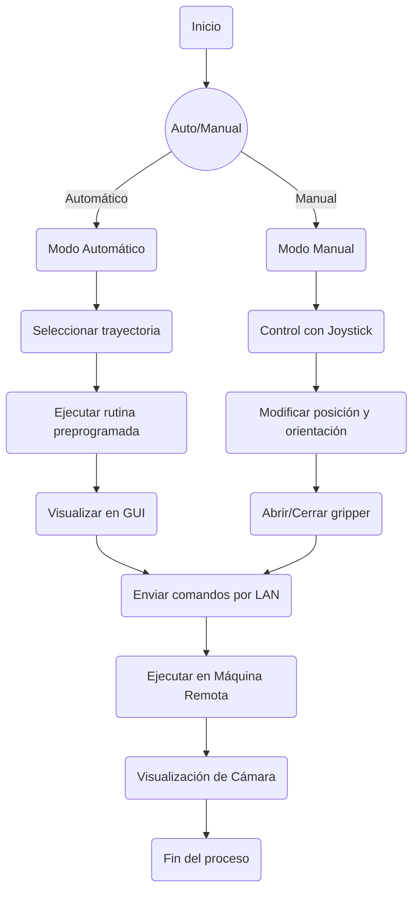

# Informe final Robotica

### Tabla de párametros DH y cinemática Directa (incluye un reultado númerico).

Obtenidas mediante el RVCToolbox de PeterCorke
```
%% MODELO DEL ROBOT CON ROBOTICS TOOLBOX
L1 = Link('d', 0.137, 'a', 0, 'alpha', -pi/2, 'offset', 0);
L2 = Link('d', 0, 'a', 0.105, 'alpha', 0, 'offset', -pi/2);
L3 = Link('d', 0, 'a', 0.105, 'alpha', 0, 'offset', 0);
L4 = Link('d', 0, 'a', 0.110, 'alpha', 0, 'offset', 0);
```

### Cálculo de la Cinemática Inversa del pincher (incluye un resultado númerico).

El cálculo fue realizaddo utilizando este código en MATLAB.

```
function [theta_0, theta_1, theta_2, theta_3] = inverse_kinematics(X, Y, Z, phi)
    % Longitudes de los eslabones
    a0 = 0.137;
    a1 = 0.105;
    a2 = 0.105;
    a3 = 0.110;
    
    phi1=deg2rad(phi);
    phi1=-phi1;

    % Ángulo base
    theta_0 = atan2(Y, X);
    
    % Proyección en el plano XY
    xb = sqrt(X^2 + Y^2);
    yb = Z - a0;
    
    xa = xb - a3*cos(phi1);
    ya = yb - a3*sin(phi1);
    
    D = sqrt(xa^2 + ya^2);

    % Verificar alcanzabilidad
    if D > (a1 + a2) || D < abs(a1 - a2)
        error('Posición no alcanzable');
    end


    cos_theta2 = (D^2 - a1^2 - a2^2)/(2*a1*a2);
    theta_2 = acos(cos_theta2);
    theta_2_alt = -theta_2;

    % Calcular ángulos theta1
    alpha = atan2(ya, xa);
    beta = atan2(a2*sin(theta_2), a1 + a2*cos(theta_2));
    theta_1 = alpha - beta;
    theta_1 = alpha - beta + 90;

    beta_alt = atan2(a2*sin(theta_2_alt), a1 + a2*cos(theta_2_alt));
    theta_1_alt = alpha - beta_alt;
    
    % Calcular theta3
    theta_3 = phi1 - theta_1 - theta_2;
    theta_3_alt = phi1 - theta_1_alt - theta_2_alt;

    % Convertir a grados
    theta_0 = rad2deg(theta_0);
    theta_1 = rad2deg(theta_1_alt);
    theta_1 = theta_1 - 90;
    theta_2 = rad2deg(theta_2_alt);
    theta_3 = rad2deg(theta_3_alt);

    theta_1 = -theta_1;
    theta_2 = -theta_2;
    theta_3 = -theta_3;
end
```
## Descripción de la solución creada, el proceso de preparación y programación (hay que ser detallado, podemos usar los vídeos del whatsapp en esta parte).

Para la solución del problema decidimos usar un paquete de ROS2 que crease un nodo tipo publisher, el cual publica un mensaje  un tópico dado en base a los comandos recibidos desde el joystick. Una vez el nodo envía los mensajes con el formato correcto podemos configurar otro nodo que este suscrito a ese  tópico y mueva una simulación en coppelia usando los comandos recibidos. De la misma forma para mover el robot físico se utiliza el paquete de dynamixel sdk para crear un segundo nodo suscrito al tópico y enviarle las mismas instrucciones de comando


## Diagrama de flujo de las acciones del robot.

### Plano de planta y descripción de la teleoperación.

Markup : *Configuración: Se establece una conexión de red local (LAN) entre dos computadoras. La Computadora 1 (zona local/maestro) es donde se encuentra el operador que controla y supervisa el proceso. La Computadora 2 (zona remota) ejecuta la simulación virtual del proceso Pick & Place.

*Comunicación: La Computadora 1 envía instrucciones y datos a la Computadora 2 a través de la conexión LAN, lo que permite al operador controlar la simulación en tiempo real desde la zona local

¿Interfaz de Usuario: En la zona local, el operador puede seleccionar entre los modos de operación a través de una interfaz de usuario. Se utiliza un joystick para controlar la zona remota.

*Simulación: En la zona remota, se ejecuta una simulación en CoppeliaSim dentro de ROS, representando la estación con el robot Phantom, que recibe información de la zona local.

*Operación Manual: El usuario controla el robot en tiempo real con un joystick, cambiando la posición y orientación de manera intuitiva. El joystick permite modificar la posición (x, y, z) del efector final del robot y realizar la reorientación, manteniendo una posición fija. Además, se implementa una función para abrir y cerrar el gripper usando un botón en el joystick. El joystick opera en modo de velocidad, donde la posición del stick es proporcional al delta de desplazamiento.
*
Cámara Virtual: Se implementa una cámara virtual en la simulación para proporcionar una visualización del robot al usuario en el punto de acceso local
*
Interfaz Gráfica Remota: La interfaz gráfica en el punto de acceso remoto incluye botones para iniciar y detener el proceso, indicadores del estado del proceso y el modo (manual/automático), representación de la posición actual del robot, visualización de la cámara y selector de modo y trayectoria.
*
Entorno de Simulación: La simulación debe incluir objetos sólidos que el robot pueda manipular.

### Código en Matlab o Python de la solución.

Implementación en Python de la solución al proyecto

```
#!/usr/bin/env python3
import rclpy
from rclpy.node import Node
from sensor_msgs.msg import JointState
from dynamixel_sdk import *  # Importa la librería de Dynamixel SDK

# 📌 Configuración del puerto y baudrate
DEVICENAME = "/dev/ttyUSB0"  # Ajusta según tu sistema
BAUDRATE = 1000000  # 1 Mbps, recomendado para AX-12A

# 📌 Direcciones de memoria en los motores Dynamixel AX-12A
ADDR_TORQUE_ENABLE = 24
ADDR_GOAL_POSITION = 30
ADDR_PRESENT_POSITION = 36
ADDR_MOVING_SPEED = 32
ADDR_TORQUE_LIMIT = 34

# 📌 Parámetros del motor
DXL_IDs = [1, 2, 3, 4, 5]  # IDs de los motores del brazo
TORQUE_ENABLE = 1  # Habilitar torque
TORQUE_DISABLE = 0  # Deshabilitar torque
MOVING_SPEED = {1: 40, 2: 40, 3: 40, 4: 40, 5: 1023}  # Velocidad del motor (0-1023)
TORQUE_LIMITS = {1: 300, 2: 600, 3: 600, 4: 600, 5: 1023}  # Límite de torque para cada motor
GOAL_POSITION_DEFAULT = {1: 1023, 2: 512, 3: 512, 4: 512, 5: 512}  # Posición inicial

class PhantomXController(Node):
    def __init__(self):
        super().__init__('phantomx_controller')

        # 📌 Inicialización del puerto de comunicación
        self.portHandler = PortHandler(DEVICENAME)
        self.packetHandler = PacketHandler(1.0)  # AX-12A usa protocolo 1.0

        if not self.portHandler.openPort():
            self.get_logger().error("❌ Error: No se pudo abrir el puerto")
            exit()
        if not self.portHandler.setBaudRate(BAUDRATE):
            self.get_logger().error("❌ Error: No se pudo establecer el baudrate")
            exit()

        # 📌 Configurar motores con torque, velocidad y posición inicial
        for dxl_id in DXL_IDs:
            self.packetHandler.write1ByteTxRx(self.portHandler, dxl_id, ADDR_TORQUE_ENABLE, TORQUE_ENABLE)
            self.packetHandler.write2ByteTxRx(self.portHandler, dxl_id, ADDR_TORQUE_LIMIT, TORQUE_LIMITS[dxl_id])
            self.packetHandler.write2ByteTxRx(self.portHandler, dxl_id, ADDR_MOVING_SPEED, MOVING_SPEED[dxl_id])
            self.packetHandler.write2ByteTxRx(self.portHandler, dxl_id, ADDR_GOAL_POSITION, GOAL_POSITION_DEFAULT[dxl_id])

        self.get_logger().info("✅ Motores configurados con torque, velocidad y posición inicial")

        # 📌 Suscribirse a comandos de posición
        self.subscription = self.create_subscription(
            JointState, '/coppelia/joint_commands', self.joint_command_callback, 10)

        # 📌 Publicador del estado de las articulaciones
        self.publisher = self.create_publisher(JointState, '/phantomx/joint_states', 10)

    def joint_command_callback(self, msg):
        """ Recibe comandos de posición y mueve los motores """
        positions = msg.position  # Recibe un array de posiciones
        if len(positions) < len(DXL_IDs):
            self.get_logger().error("❌ Error: Número de posiciones incorrecto")
            return

        for i, dxl_id in enumerate(DXL_IDs):
            goal_position = int((positions[i] / 3.14) * 512) + 512  # Convertir radianes a valores Dynamixel
            goal_position = max(0, min(1023, goal_position))  # Limitar dentro del rango permitido

            dxl_comm_result, dxl_error = self.packetHandler.write2ByteTxRx(
                self.portHandler, dxl_id, ADDR_GOAL_POSITION, goal_position
            )

            if dxl_comm_result != COMM_SUCCESS:
                self.get_logger().error(f"❌ Error al mover el motor {dxl_id}")
            elif dxl_error:
                self.get_logger().error(f"⚠️ Advertencia en motor {dxl_id}: {dxl_error}")

        self.publish_joint_states()

    def publish_joint_states(self):
        """ Publica la posición actual de los motores """
        joint_state_msg = JointState()
        joint_state_msg.header.stamp = self.get_clock().now().to_msg()
        joint_state_msg.name = [f"joint_{i+1}" for i in range(len(DXL_IDs))]
        joint_positions = []

        for dxl_id in DXL_IDs:
            dxl_present_position, dxl_comm_result, dxl_error = self.packetHandler.read2ByteTxRx(
                self.portHandler, dxl_id, ADDR_PRESENT_POSITION
            )
            if dxl_comm_result != COMM_SUCCESS or dxl_error:
                self.get_logger().error(f"❌ No se pudo leer la posición del motor {dxl_id}")
                joint_positions.append(0.0)
            else:
                joint_positions.append((dxl_present_position - 512) * 3.14 / 512)  # Convertir a radianes

        joint_state_msg.position = joint_positions
        self.publisher.publish(joint_state_msg)

    def destroy_node(self):
        """ Apaga los motores y cierra el puerto al finalizar el nodo """
        for dxl_id in DXL_IDs:
            self.packetHandler.write1ByteTxRx(self.portHandler, dxl_id, ADDR_TORQUE_ENABLE, TORQUE_DISABLE)

        self.portHandler.closePort()
        super().destroy_node()

def main(args=None):
    rclpy.init(args=args)
    controller = PhantomXController()

    try:
        rclpy.spin(controller)
    except KeyboardInterrupt:
        print("\nApagando el nodo...")
    finally:
        controller.destroy_node()
        rclpy.shutdown()

if __name__ == '__main__':
    main()
```
### Comparación objetiva de la teleoperación manual y automática realizada los robots.

|Teleoperación Manual|Operación Automática|
|---|---|
|Requiere al operador en todo momento|No requiere que ningún operador este presente para que se ejecute|
|require mayor poder computacional|requiere menos capacidad por parte de la computadora|
|el joystick opera manipulando la velocidad|el usuario selecciona un punto de salida y la rutina preprogamada hace el resto|

### Vídeo de la implementación (Incluir la ).


